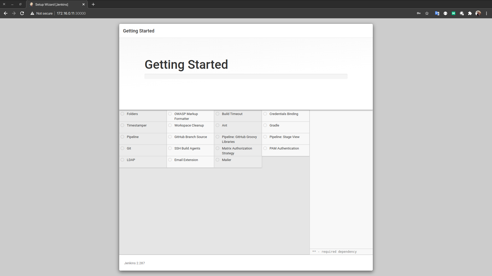

# Chapter 02 - Kubernetes에 Jenkins를 배포

로컬환경에서 개발을 하다 보면 Sandbox 목적의 Kubernetes의 필요성을 느낄 수 있다.
이 예제는 로컬환경에서 Kubernetes Cluster를 구축하고 Jenkins를 통한 Springboot Application을 배포하고자 한다.

다음의 Contents를 포함하고 있습니다.
1. Jenkins Namespace 생성
2. Jenkins를 사용할 Service Account의 생성
3. Jenkins의 설정을 저장할 Persistence Volume의 생성 및 연결
4. Jenkins를 접근할 Serivce 생성


# 1. Jenkins 설치

---
## 1.1 jenkins가 동작할 namespace 생성

```sh
❯ kubectl create namespace jenkins
namespace/jenkins created
```

---
## 1.2 jenkins를 사용할 Service Account 생성

Kubernetes에서 Jenkins를 사용하는 방법은 크게 두가지로 나눌 수 있습니다. Jenkins Pod이 동작하는 VM Host의 자원을 이용하여 빌드를 수행하는 방법과 Jenkins를 통한 Application 빌드시 별도의 Builder Pod을 실행시켜 Pipeline을 수행하는 방법입니다.

우리는 후자인 별도의 Builder Pod을 실행시켜 이용할 예정입니다. 이 경우 실행된 Jenkins가 내부의 Pod을 동작시킬 수 있는 특별한 역할할 수 있어야 하는데 이러한 Role(Cluster Admin)을 갖는 Service Account를 생성합니다.

```sh
❯ kubectl apply -f 01_role.yaml
serviceaccount/jenkins created
clusterrolebinding.rbac.authorization.k8s.io/cluster-admin-clusterrolebinding created
clusterrolebinding.rbac.authorization.k8s.io/cluster-admin-clusterrolebinding-2 created
```
---
## 1.3 jenkins 설정을 저장할 Persistence Volume 생성

여느 Cloud 환경과 마찬가지로 Application을 담는 Container가 재시작되면 해당 Container 볼륨은 사라진다. 앞으로 살펴볼 Jenkins의 경우도 관련 설정들이 많고 기본적으로 로컬환경에 생성한 Pipeline 정보들을 저장한다.

이를 유지 하기 위해 Kubernetes는 Persistence Volume이라는 기능을 제공해 주고 있다.

우리는 Persistence Volume 중 Static 형태로 Host의 일부 영역을 사용해 볼 것이다.

### 1.3.1 Host(Node1)의 Volume 준비하기

- ssh를 이용해 node1에 접속한다. vagrant의 기본 Password는 vagrant이다.
  ```sh
  ❯ ssh vagrant@172.16.0.11 
  ```
- 또는 vagrantfile이 있는 위치에서 vagrant 명령을 통해 접근 할 수도 있다.
  ```sh
  ❯ vagrant ssh node1.k8s
  ```
- node1의 '/opt/jenkins/workspace' 디렉토리를 생성하고 vagrant 계정에 권한을 분리한다.
  ```sh
  vagrant@node1:~$ sudo mkdir -p /opt/jenkins/workspace
  vagrant@node1:~$ sudo chown vagrant:vagrant /opt/jenkins/workspace
  ```

### 1.3.2 Persistence Volume 생성하기

- 이전에 생성한 Node1의 Volume을 이용해 PV를 생성한다.
  ```sh
  ❯ kubectl apply -f ./02_pv.yaml
  persistentvolume/jenkins-storage created

  ❯ kubectl get pv -n jenkins
  NAME         CAPACITY   ACCESS MODES   RECLAIM POLICY   STATUS      CLAIM   STORAGECLASS    REASON   AGE
  jenkins-pv   20Gi       RWO            Retain           Available           local-storage            8s
  ```

- pv의 내용은 직관적이라 따로 설명할 것은 없습니다만, storageClassName는 우리는 host의 local-storage를 사용했지만, 여러 Cloud Provider 마다 여러 상품으로 제공 되고 있습니다. 그 보다 실습을 위해 꼭 잊지 말아야 할것은 nodeAffinity 입니다. Node1에 jenkins의 설정 저장 공간을 마련해둔 만큼 Node1을 선택해야합니다.
  ```yaml
  nodeAffinity:
      required:
        nodeSelectorTerms:
        - matchExpressions:
          - key: kubernetes.io/hostname
            operator: In
            values: 
              - node1
  ```

### 1.3.3 Persistence Volume Claim 생성하기

지금까지 host에 디렉토리를 하나만들고, PV를 만들어 디렉토리와 연결 했습니다. 하지만 우리가 배포할 Jenkins Pod에서 연결하기 위해서는 하나 더 필요합니다. 그것이 Persistence Volume Claim(PVC) 입니다.

- 먼저 pvc를 생성합니다.
  ```sh
  ❯ kubectl apply -f 03_pvc.yaml
  persistentvolumeclaim/jenkins-pvc created

  ❯ kubectl get pv -n jenkins
  NAME         CAPACITY   ACCESS MODES   RECLAIM POLICY   STATUS      CLAIM   STORAGECLASS    REASON   AGE
  jenkins-pv   20Gi       RWO            Retain           Available           local-storage            8s
  ```

- 다시 이전에 생성한 PV의 상태를 확인합니다.
  ```sh
  ❯ kubectl get pv -n jenkins
  NAME         CAPACITY   ACCESS MODES   RECLAIM POLICY   STATUS   CLAIM                 STORAGECLASS    REASON   AGE
  jenkins-pv   20Gi       RWO            Retain           Bound    jenkins/jenkins-pvc   local-storage            77s
  ```
  status가 Bound 상태임을 확인할 수 있습니다. Claim은 방금생성한 jenkins/jenkins-pvc를 확인할 수 있습니다.


---
# 2 Jenkins 설치 및 설정

## 2.1 Jenkins Deploy

 PVC도 정상적으로 생성 되었으니 준비가 완료 되었습니다. 이제 Jenkins를 배포해 보고록 해봅시다.

- 미리 만들어 놓은 Script를 이용해 봅시다.
```sh
❯ kubectl apply -f ./04_jenkins.yaml
deployment.apps/jenkins-leader unchanged
service/jenkins-leader-svc unchanged
```

- 04_jenkins.sh의 volumemount내용을 살펴 보면 우리가 만들어 놓은 PVC를 Container 내의 /var/jenkins_home에 Mount 한 것을 확인할 수 있습니다. 해당 위치가 Jenkins의 실제 설정이 저장 되는 곳입니다. 
  ```yaml
    containers:
    - name: jenkins-master
      image: jenkins/jenkins:alpine
      volumeMounts:
      - name: jenkins-home
        mountPath: /var/jenkins_home
      ports:
      - containerPort: 8080
      - containerPort: 50000
  volumes:
    - name: jenkins-home
      persistentVolumeClaim:
        claimName: jenkins-pvc
  ```

- 계속해서 04_jenkins.sh의 Service 영역을 살펴 보명 외부에서 Kubernetes 설정으로 접근하기 위해 NodePort를 정의 합니다.
  ```yaml
  apiVersion: v1
  kind: Service
  metadata:
    name: jenkins-master-svc
    namespace: jenkins
    labels:
      app: jenkins-master
  spec:
    type: NodePort
    ports:
    - port: 80
      targetPort: 8080
      protocol: TCP
      name: http
      nodePort: 30000
    - port: 50000
      protocol: TCP
      name: slave
      nodePort: 30001
    selector:
      app: jenkins-master
  ```
  NodePort로 설정한 Port는 모든 Node에서 동작합니다. 예를 들어 실제 Jenkins Pod이 Node1에서 동작하고 있더라도 Master:30000, Node1:30000, Node2:30000 모두 접근이 가능합니다.

  이제 Jenkins의 설치가 완료 되었으니 본격적으로 설정을 진행해 봅시다.

--- 
## 2.2 Jenkins 설정

### 2.2.1 Jenkins 초기 설정

- 최초 Jenkins를 접속하면 초기 패스워드를 입력해야합니다. 해당 패스워드는 Kubernetes내의 Jenkins Pod의 log에서 확인이 가능합니다.
- 로그 확인을 통한 Jenkins Password 확인 (로그 하단의 Password를 확인할 수 있습니다.

- 우선 Jenkins Pod을 확인하고,
  ```sh
  ❯ kubectl get pods -n jenkins
  NAME                              READY   STATUS    RESTARTS   AGE
  jenkins-master-86c888975d-mjsc5   1/1     Running   0          13m
  ```

- Jenkins 초기 패스워드를 확인합니다. 초기 패스워드는 Log를 통해 확인할 수 있습니다.
  ```sh
  ❯ kubectl logs -n jenkins jenkins-master-86c888975d-mjsc5
  
  ...

  *************************************************************
  *************************************************************
  *************************************************************

  Jenkins initial setup is required. An admin user has been created and a password generated.
  Please use the following password to proceed to installation:

  d8a4339c83714abc872f2f45ec17c0cd  <-- 바로 요것입니다.

  This may also be found at: /var/jenkins_home/secrets/initialAdminPassword

  *************************************************************
  *************************************************************
  *************************************************************

  ...

  ``` 
  jenkins 패스워드는 매번 다르기 때문에 각자 자신의 것을 확인해야 합니다.
  
- Web Browser를 통해 Jenkins 에 접속해서 초기 패스워드를 입력 합니다. 접속 주소는 (http://172.16.0.10:30000, http://172.16.0.11:30000, http://172.16.0.12:30000) 모두 동작합니다.




Plugin 설치는 자주 실패 하는데 두려워말고 Retry 버튼 눌러보면 설치가 됩니다.

- 관리자 계정 등록


### 2.2.2 Kubernetes Plugin 설치 및 설정

- Dashboard > Manage Jenkins > Manage Plugins > Available 로 이동 후 Kubernetes(This plugin integrates Jenkins with Kubernetes) 를 검색하여  설치 합니다.


### 2.2.3 Jenkins Cloud 설정(Kubernetes 관련 설정)

- Plugin 설치 완료 후 Dashboard > Manage Jenkins > Manage Nodes and Clouds로 이동합니다.


- 좌측의 Configure Clouds를 클릭합니다.


- Add a new Cloud를 클릭 후 'kubernetes'를 선택합니다.


- Configure Clouds에서 관련 내용을 입력한다.

  ```
  Name : kubernetes
  kubernetes URL : https://kubernetes.default.svc.cluster.local
  Disable https certificate check : Check
  kubernetes Namespace : jenkins
  Jenkins URL : http://jenkins-master-svc.jenkins.svc.cluster.local
  Jenkins tunnel : jenkins-master-svc.jenkins.svc.cluster.local:50000
  ```
- 중간에 Kubernetes Service Account를 설정합니다.(Kind: Kubernetes Service Account)  
설정을 마치면 Credentials의 SelectBox에서 Secret Text를 선책할 수 있습니다.


이제 Jenkins에서 Kubernetes를 위한 설정을 마쳤습니다. 앞으로는 실제 Application을 배포해보도록 하겠습니다.
