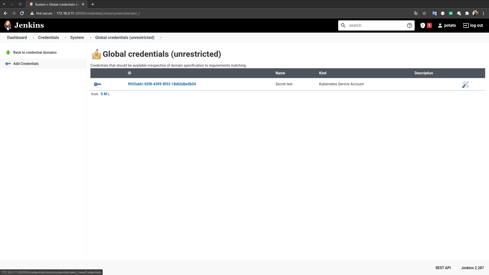
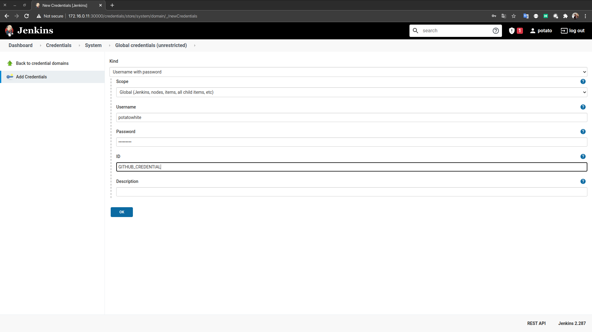
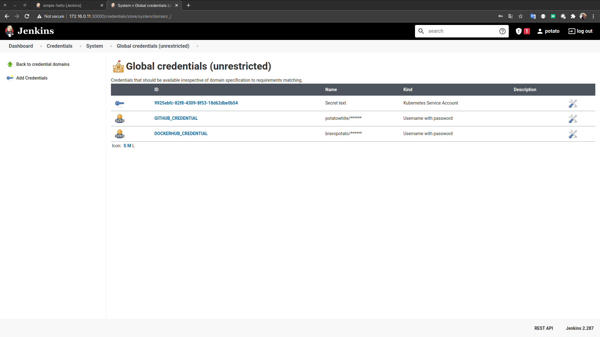
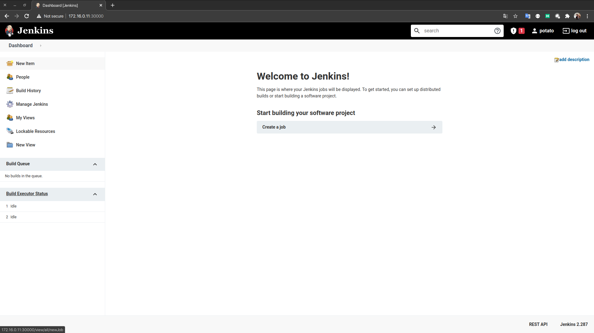
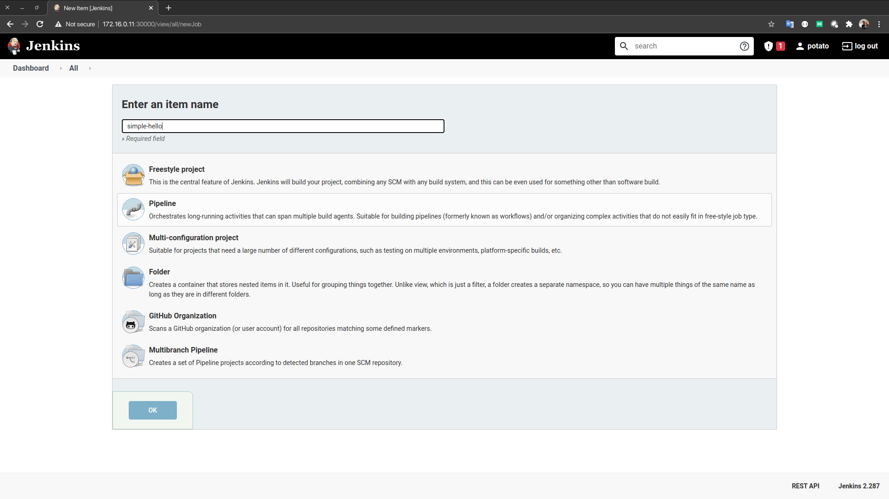
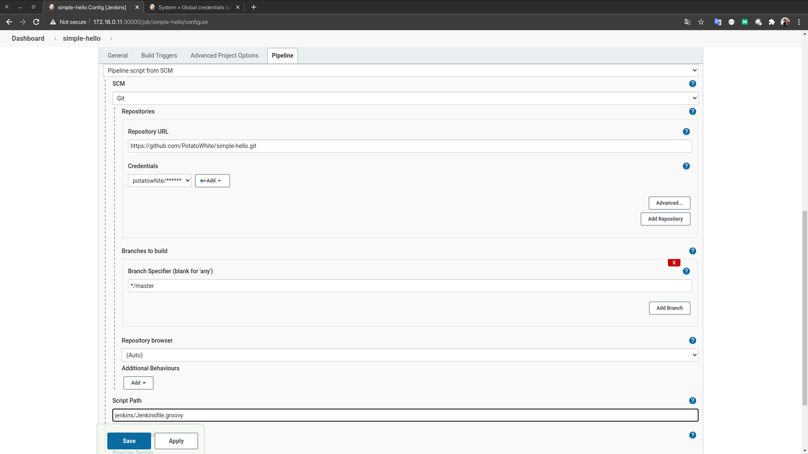

# Chapter 03 - Application 배포

- Application SCM을 GITHUB를 이용하기 위해 Github의 Credential이 필요합니다
- Build 결과를 Docker Hub에 Push 하기 위해 Docker Hub 계정이 필요합니다.
- Demo를 위한 Springboot Demo Code는 https://github.com/PotatoWhite/simple-hello.git 를 참고하여 주십시오.

# 1 CREDENTIAL 등록
- Github의 Private Repository를 이용할 경우 "git clone" 시 게정 정보가 필요하다. 이를 설정파일에 담아서 공개하는 것은 보안이슈가 있으니 Jenkins의 Credential에 등록합니다.
- 동일한 보안 사유로 docker Image가 push될 Docker Hub의 계정정보도 다음과 같이 등록합니다.

## 1.1 GITHUB 및 DOCKERHUB 계정정보 등록
- Manage Jenkins > Manage Credentials 메뉴에서 외부연동에 필요한 계정들을 입력합니다.


- Credentials의 global을 선택


- 좌측의 Add Credentials를 클릭합니다.


- 본 예제는 Github의 Private Repository를 사용하기 때문에 Github 계정정보를 등록합니다.


- 동일한 방법으로 DOCKERHUB_CREDENTIAL을 등록합니다.


## 1.2 Pipeline 생성
- Jenkins Dashboard의 "New Item"을 클릭합니다.


- Item Name을 입력하고 Pipeline을 선택합니다.


- git 관련 설정을 하고 Jenkins Script 위치를 지정합니다.


- 잠시 후 생성된 Pipeline의 Build Now를 클릭해 동작을 확인해 봅시다.

## 1.3 배포 상태 확인

- 우선 Deploy와 Pod의 상태를 확인해 봅시다.
  ```shell
  ❯ kubectl get deploy -n ns-demo -o wide
  NAME                      READY   UP-TO-DATE   AVAILABLE   AGE   CONTAINERS     IMAGES                       SELECTOR
  simple-hello-deployment   2/2     2            2           15m   simple-hello   bravopotato/simple-hello:4   app=simple-hello
  ```
  2개의 Pod이 Ready 중입니다.

- 이번에는 Service를 확인합니다.
  ```sh
  ❯ kubectl get service -n ns-demo -o wide
  NAME               TYPE           CLUSTER-IP     EXTERNAL-IP   PORT(S)        AGE   SELECTOR
  simple-hello-svc   LoadBalancer   10.98.239.45   <pending>     80:30226/TCP   17m   app=simple-hello
  ```
  10.98.239.45 IP가 Service에 할당 되었고 80포트를 이용해 호출 할 수 있습니다.

- 우선 Deploy와 Pod의 상태를 확인해 봅시다.
  ```shell
  NAME                                     READY   STATUS    RESTARTS   AGE     IP               NODE    NOMINATED NODE   READINESS GATES
  simple-hello-deployment-d5c7b459-5hrbj   1/1     Running   0          3m50s   10.244.166.135   node1   <none>           <none>
  simple-hello-deployment-d5c7b459-vg9p4   1/1     Running   0          3m10s   10.244.104.5     node2   <none>           <none>
  ```
  Source Code내의 Deploy에 정의된 Replicas가 2인 만큼 2개의 Pod이 생성되었고 각각 내부 IP가 할당 되었습니다.

- 이제 Host인 VM에 연결해 curl을 통해 API를 호출해 보겠습니다.
  ```sh
  ❯ ssh vagrant@172.16.0.11
  vagrant@172.16.0.11's password: 

  vagrant@node1:~$ curl 10.98.239.45/simple-hello/hello
  Hello World from ConfigMap {simple-hello-deployment-d5c7b459-5hrbj 10.244.166.135}
  ```

지금까지 Application 배포에 대해서 Quick하게 알아 보았습니다. 하지만 아직 Node 내부에서만 호출이 가능한 상태 입니다. 다음시간에는 Ingress 및 LoadBalancer를 통해 Cluster 외부에서 어떻게 호출을 할 수 있는지 알아보도록 하겠습니다.

