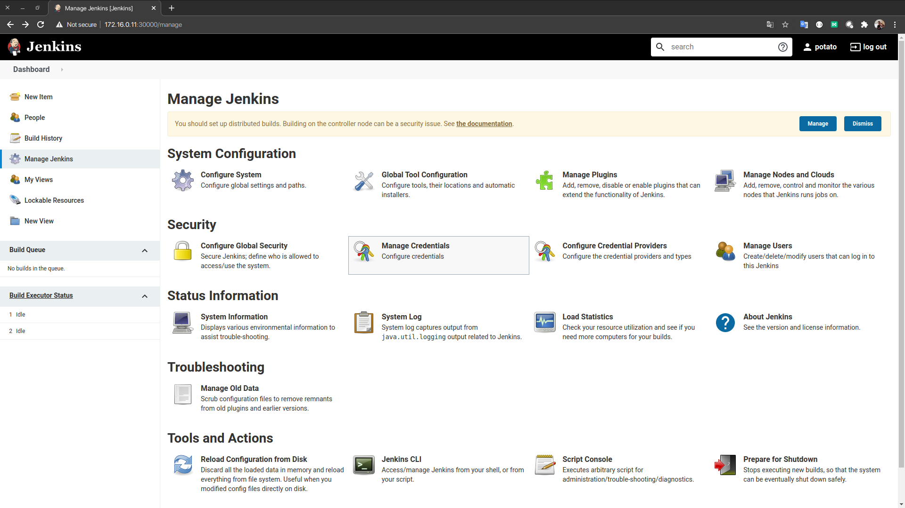
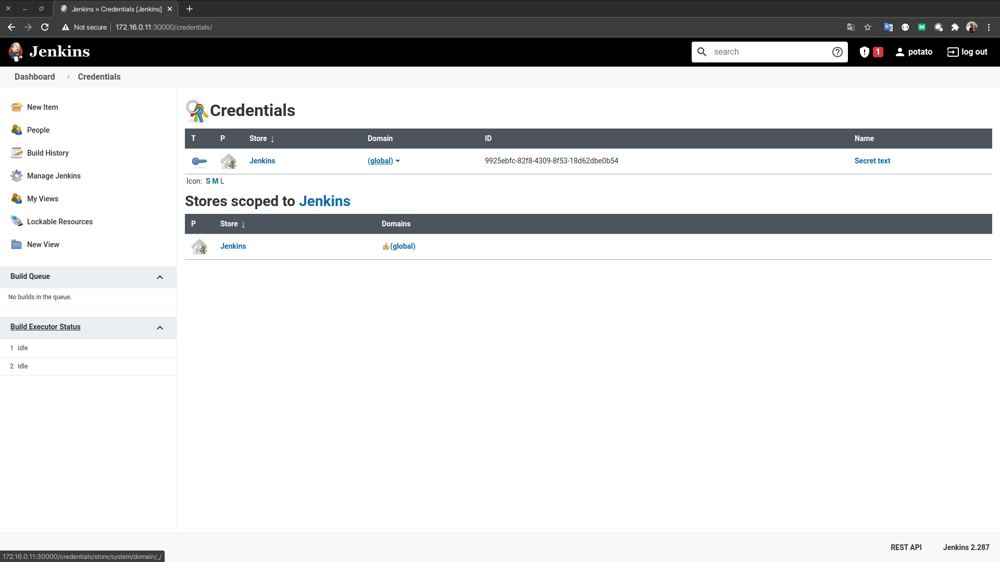
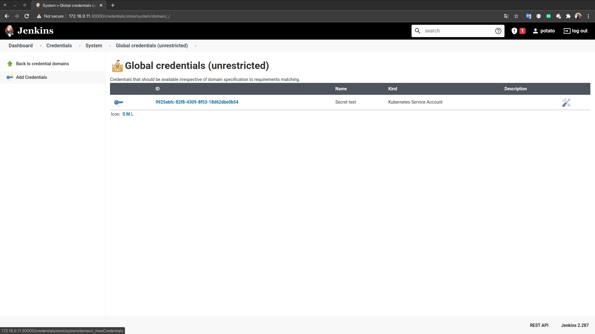
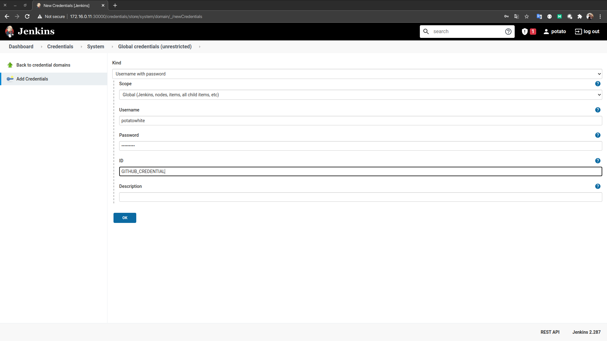
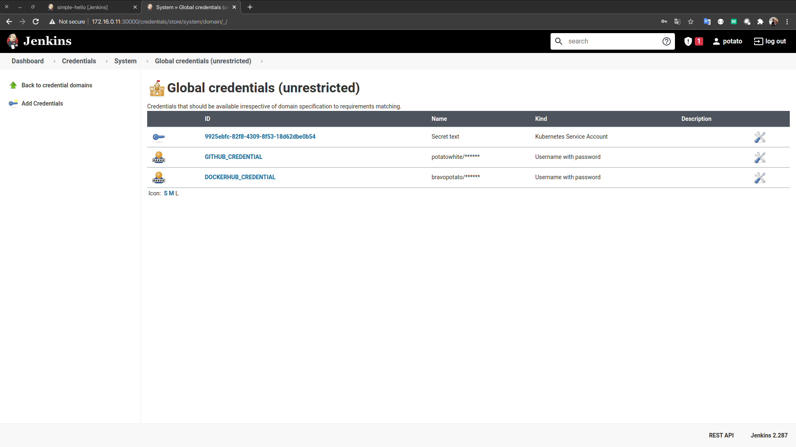
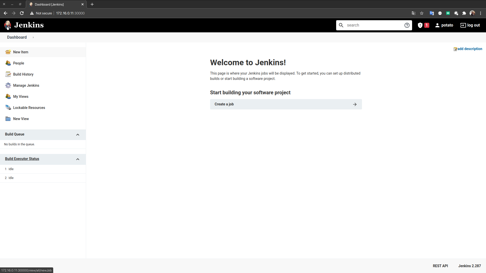
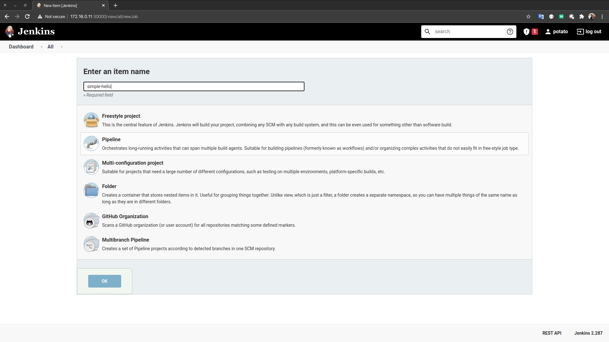
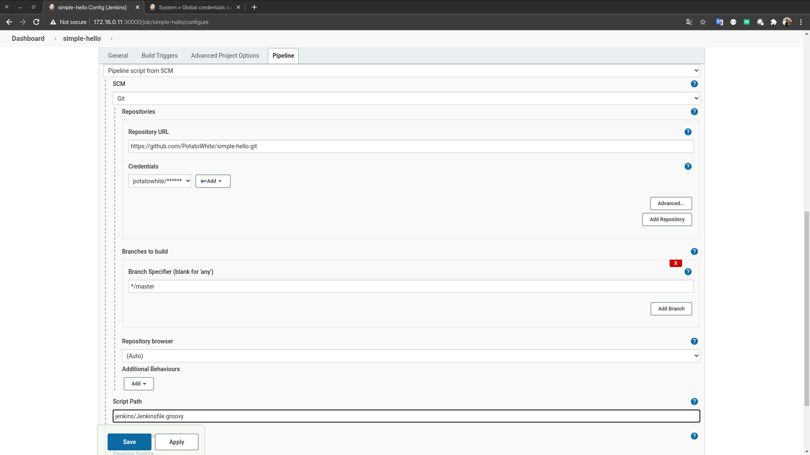

# Chapter 03 - Application 배포

## 진행 순서
1. 먼저 Sample Application을 배포합니다.
2. 배포에 필요한 내용을 살펴 볼 것입니다.

## 필요사항
- Application SCM을 GITHUB를 이용하기 위해 Github의 Credential이 필요합니다
- Build 결과를 Docker Hub에 Push 하기 위해 Docker Hub 계정이 필요합니다.
- Demo를 위한 Springboot Demo Code는 https://github.com/PotatoWhite/simple-hello.git 를 참고하여 주십시오.

# 1 CREDENTIAL 등록
- Github의 Private Repository를 이용할 경우 "git clone" 시 게정 정보가 필요하다. 이를 설정파일에 담아서 공개하는 것은 보안이슈가 있으니 Jenkins의 Credential에 등록합니다.
- 동일한 보안 사유로 docker Image가 push될 Docker Hub의 계정정보도 다음과 같이 등록합니다.

## 1.1 GITHUB 및 DOCKERHUB 계정정보 등록
- Manage Jenkins > Manage Credentials 메뉴에서 외부연동에 필요한 계정들을 입력합니다.


- Credentials의 global을 선택


- 좌측의 Add Credentials를 클릭합니다.


- 본 예제는 Github의 Private Repository를 사용하기 때문에 Github 계정정보를 등록합니다.


- 동일한 방법으로 DOCKERHUB_CREDENTIAL을 등록합니다.


## 1.2 Pipeline 생성
- Jenkins Dashboard의 "New Item"을 클릭합니다.


- Item Name을 입력하고 Pipeline을 선택합니다.


- git 관련 설정을 하고 Jenkins Script 위치를 지정합니다.


- 잠시 후 생성된 Pipeline의 Build Now를 클릭해 동작을 확인해 봅시다.

## 1.3 배포 상태 확인

- 우선 Deploy와 Pod의 상태를 확인해 봅시다.
  ```shell
  ❯ kubectl get deploy -n ns-demo -o wide
  NAME                      READY   UP-TO-DATE   AVAILABLE   AGE   CONTAINERS     IMAGES                       SELECTOR
  simple-hello-deployment   2/2     2            2           15m   simple-hello   bravopotato/simple-hello:4   app=simple-hello
  ```
  2개의 Pod이 Ready 중입니다.

- 이번에는 Service를 확인합니다.
  ```sh
  ❯ kubectl get service -n ns-demo -o wide
  NAME               TYPE           CLUSTER-IP     EXTERNAL-IP   PORT(S)        AGE   SELECTOR
  simple-hello-svc   LoadBalancer   10.98.239.45   <pending>     80:30226/TCP   17m   app=simple-hello
  ```
  10.98.239.45 IP가 Service에 할당 되었고 80포트를 이용해 호출 할 수 있습니다.

- 우선 Deploy와 Pod의 상태를 확인해 봅시다.
  ```shell
  NAME                                     READY   STATUS    RESTARTS   AGE     IP               NODE    NOMINATED NODE   READINESS GATES
  simple-hello-deployment-d5c7b459-5hrbj   1/1     Running   0          3m50s   10.244.166.135   node1   <none>           <none>
  simple-hello-deployment-d5c7b459-vg9p4   1/1     Running   0          3m10s   10.244.104.5     node2   <none>           <none>
  ```
  Source Code내의 Deploy에 정의된 Replicas가 2인 만큼 2개의 Pod이 생성되었고 각각 내부 IP가 할당 되었습니다.

- 이제 Host인 VM에 연결해 curl을 통해 API를 호출해 보겠습니다.
  ```sh
  ❯ ssh vagrant@172.16.0.11
  vagrant@172.16.0.11's password: 

  vagrant@node1:~$ curl 10.98.239.45/simple-hello/hello
  Hello World from ConfigMap {simple-hello-deployment-d5c7b459-5hrbj 10.244.166.135}
  ```

지금까지 Application 배포에 대해서 Quick하게 알아 보았습니다. 하지만 아직 Node 내부에서만 호출이 가능한 상태 입니다. 다음시간에는 Ingress 및 LoadBalancer를 통해 Cluster 외부에서 어떻게 호출을 할 수 있는지 알아보도록 하겠습니다.

# 2. 배포 환경 살펴보기

이제 설명할 내용은 https://github.com/PotatoWhite/simple-hello.git 의 내용입니다.

## 2.1 jenkins/Jenkinsfile.groovy

- 중요한 내용은 몇가지 주석을 넣었습니다.
  ```groovy
  def DOCKER_IMAGE_NAME = "bravopotato/simple-hello"
  def DOCKER_IMAGE_TAGS = "demo"
  def VERSION = "${env.BUILD_NUMBER}"

  def NAMESPACE = 'ns-demo'
  def DATE = new Date();

  podTemplate(label: 'builder',
          containers: [
                  containerTemplate(name: 'gradle', image: 'gradle:6.8.3-jdk11', command: 'cat', ttyEnabled: true),
                  containerTemplate(name: 'docker', image: 'docker:20.10.5-dind', command: 'dockerd-entrypoint.sh', ttyEnabled: true, privileged: true),
                  containerTemplate(name: 'kubectl', image: 'lachlanevenson/k8s-kubectl:v1.20.5', command: 'cat', ttyEnabled: true)
          ],
          volumes: [
                  hostPathVolume(mountPath: '/home/gradle/.gradle', hostPath: '/home/admin/k8s/jenkins/.gradle')
          ]) {
      node('builder') {
          stage('Checkout') {
              /* SourceCode를 Github로 부터 가져옵니다.*/
              checkout scm
          }
          stage('Build') {
              container('gradle') {
                  /* 도커 이미지를 활용하여 gradle 빌드를 수행하여 ./build/libs에 jar파일 생성합니다. */
                  sh "gradle -x test build"
              }
          }
          stage('Docker Build & Push') {
              container('docker') {
                  withCredentials([usernamePassword(
                          credentialsId: 'DOCKERHUB_CREDENTIAL',
                          usernameVariable: 'USERNAME',
                          passwordVariable: 'PASSWORD')]) {
                      /* Dockerfile을 도커파일을 활용하여 빌드합니다. */
                      sh "docker build -t ${DOCKER_IMAGE_NAME}:${VERSION} ."

                      /* DockerHub에 빌드된 내용을 Push합니다. */
                      sh "docker login -u ${USERNAME} -p ${PASSWORD}"
                      sh "docker push ${DOCKER_IMAGE_NAME}:${VERSION}"
                  }
              }
          }
          stage('Deploy') {
              container('kubectl') {
                  withCredentials([usernamePassword(
                          credentialsId: 'DOCKERHUB_CREDENTIAL',
                          usernameVariable: 'USERNAME',
                          passwordVariable: 'PASSWORD')]) {
                      /* namespace 존재여부 확인. 미존재시 namespace 생성 */
                      sh "kubectl get ns ${NAMESPACE}|| kubectl create ns ${NAMESPACE}"
                      sh "echo ${DATE}"
                      sh "kubectl apply -f ./k8s/configmap.yml -n ${NAMESPACE}"
                      sh "kubectl apply -f ./k8s/service.yml -n ${NAMESPACE}"

                      /* DockerHub에 배포된 버전으로 deploy 이미지를 변경 */
                      sh "sed s%IMAGE_NAME_PLACEHOLDER%${DOCKER_IMAGE_NAME}:${VERSION}% k8s/deploy.yml > k8s-deploy.yml"
                      sh "cat k8s-deploy.yml"

                      sh "kubectl apply -f ./k8s-deploy.yml -n ${NAMESPACE}"
                  }
              }
          }
      }
  }
  ```

## 2.3 Deploy - 등록된 Image를 Kubernetes 상에 Pod으로 Instance화 한다.
- 일반적인 Deploy 내용이지만 중간의 IMAGE_NAME_PLACEHOLDER를 볼 수 있다.
  ```yaml
  apiVersion: apps/v1
  kind: Deployment
  metadata:
    name: simple-hello-deployment
  spec:
    replicas: 2
    selector:
      matchLabels:
        app: simple-hello
    template:
      metadata:
        labels:
          app: simple-hello
      spec:
        containers:
          - name: simple-hello
            image: IMAGE_NAME_PLACEHOLDER
            ports:
              - containerPort: 8080
            imagePullPolicy: Always
            envFrom:
              - configMapRef:
                  name: simple-hello
            readinessProbe:
              failureThreshold: 20
              httpGet:
                path: /simple-hello/health
                port: 8080
              initialDelaySeconds: 30
              periodSeconds: 10
              successThreshold: 1
              timeoutSeconds: 3
  ```  

## 2.4 Service - Deploy가 실행한 Pod들을 호출하는 EndPoint이다.
- 물론 Pod의 IP를 통해 직접 통신이 가능하지만 새로운 Pod이 실행되거나 기존 Pod이 사라지는 경우 EndPoint가 사라질 수 있다.
- 따라서 Service를 통해 Service의 EndPoint를 생성하는 것이 바람직합니다.
  ```yaml
  apiVersion: v1
  kind: Service
  metadata:
    name: simple-hello-svc
  spec:
    ports:
      - name: "http"
        port: 80
        targetPort: 8080
    selector:
      app: simple-hello
    type: LoadBalancer
  ```
  type을 보면 LoadBalancer로 되어있지만 아직은 LoadBalancer가 설치 되지 않아 외부에서는 접근할 수 없습니다.

## 2.5 ConfigMap - Application 설정의 분리
- 12Factors를 살펴 보면,
  ```
  애플리케이션의 설정은 배포 (스테이징, 프로덕션, 개발 환경 등) 마다 달라질 수 있는 모든 것들입니다. 설정에는 다음이 포함됩니다.

  데이터베이스, memcached 등 백엔드 서비스들의 리소스 핸들
  Amazon S3 이나 트위터 등의 외부 서비스 인증 정보
  배포된 호스트의 정규화된 호스트 이름(canonical hostname)처럼 각 배포마다 달라지는 값
  애플리케이션은 종종 설정을 상수로 코드에 저장합니다. 이것은 Twelve-Factor를 위반하며, Twelve-Factor는 설정을 코드에서 엄격하게 분리하는 것을 요구합니다. 설정은 배치마다 크게 다르지만, 코드는 그렇지 않습니다.
  ``` 
  라고 명시 되어있습니다.
- Application에서 사용할 설정은 보통 동작에 필요한 설정이나, DBMS등의 접속 정보를 들 수 있습니다. Kubernetes 또한 플랫폼 차원에서 여러가지 기능을 제공해 주지만 가장 기본적인 ConfigMap을 알아보도록 하겠습니다.
- 예제의 configmap.yml에 resources.greeting 가 설정 되어있습니다.
  ```yaml
  apiVersion: v1
  kind: ConfigMap
  metadata:
    name: simple-hello
  data:
    resources.greeting: "Hello World from ConfigMap"
  ```
- 예제는 Springboot 기반이므로 application.yml이 다음과 같이 설정 되어있습니다.
  ```yaml
  server:
    servlet:
      context-path: /simple-hello
  app:
    resources:
        greeting: ${resources.greeting}
  ```
  ${resources.greeting} 를 configmap의 내용을 통해 주입받을 수 있습니다.
- 실제 주입되는 방법은 Jenkinsfile과 Deploy에 정의 되어있습니다.
  ```groovy
  [Jenkinsfile]

  - configMapRef:
      name: simple-hello
  ```
  ```yaml
  [Deploy]
  
  envFrom:
  - configMapRef:
      name: simple-hello
  ```
